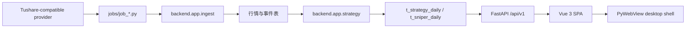

# 架构与模块边界

## 运行流

## 模块职责

| 模块 | 唯一职责 | 不应承担 |
|---|---|---|
| `backend/main.py` | 应用装配、中间件、生命周期、静态资源 | SQL、业务评分 |
| `backend/app/api.py` | HTTP 参数适配与响应组装 | 新算法、批处理编排 |
| `backend/app/ingest.py` | 外部数据同步和策略结果构建 | UI 文案、发布脚本 |
| `backend/app/strategy/` | 纯策略与共享指标计算 | 数据库访问、HTTP 调用 |
| `backend/app/db.py` | SQLite/MySQL 连接和持久化原语 | 业务字段解释 |
| `backend/app/data_health.py` | 数据完整性观察与修复建议 | 隐式吞掉结构迁移失败 |
| `jobs/` | 可执行任务编排 | 重复实现采集或算法 |
| `frontend/src/api/` | HTTP 客户端 | 页面状态与策略计算 |
| `frontend/src/views/` | 页面交互与呈现 | 后端业务真相 |

## 策略子模块

- `base.py`：所有策略共享的调用契约和结果类型。
- `indicators.py`：有限数值解析、复权因子、复权均线、ST 名称判断。
- `chaos.py`：量价无序度公式、阈值和评分映射。
- `vacuum_strategy.py`：阻力最小爆发模型。
- `sniper_strategy.py`：极简狙击手组合评分与拒绝规则。
- `field_catalog.py`：面向展示和健康检查的字段目录。

## 依赖规则

1. `strategy` 不依赖数据库、API、作业或前端。
2. API 和作业可调用应用服务；应用服务不能反向依赖 API。
3. 数据库 schema 字段变更必须同时覆盖初始化、存量迁移、Pydantic schema、API、前端和测试。
4. 兼容字段必须在文档中标明真实语义与退出条件。
5. 拆分 `api.py` 或 `ingest.py` 时先保持函数入口与测试 patch 点，再逐个迁移领域路由/适配器。
